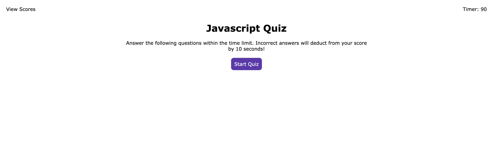

# Javascript Quiz

## Built With
* HTML
* CSS
* JavaScript

## Screenshot
Screenshot of the quiz:
    

## Purpose
HTML, CSS, and JavaScript are used in this project for creating a timed multiple-choice quiz that saves high scores of each individual in local storage.
The building process involved several steps:
    *Creating a starting screen that gets displayed a couple of rules then becomes hidden once the      start-quiz button is clicked.
    *Creating an array of series of questions and answers that cycles until there are no more questions.
    *Tracking which answer was chosen based on option button clicked.
    *Dynamically creating HTML elements including a form, input field, and button for users to submit their initials.
    *Saving high scores to local storage using Javascript Map data structure upon submitting the form.
    *Creating a separate HTML file for high scores.
    *Loading high scores from local storage to the separate HTML file.

In the process of working on this project I learned a new way of using Javascript, HTML files, and CSS.

## Website
[Javascript quiz]

